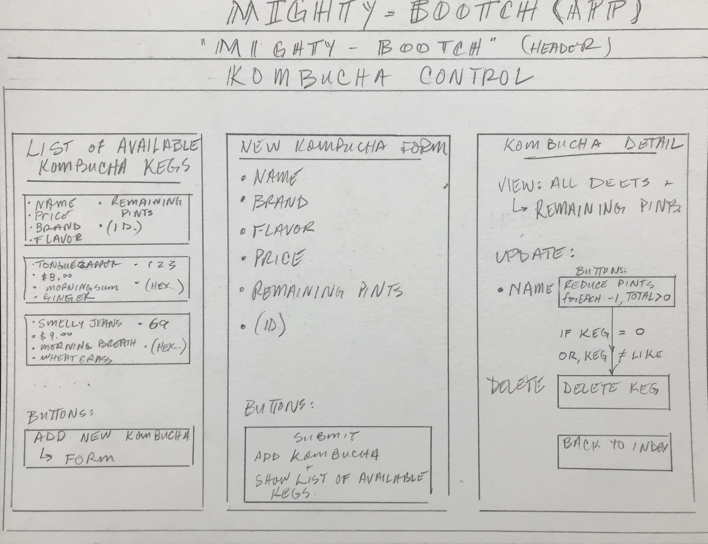

<h1 align='center'> 

**<h1 align = 'center'>MightyBootch**

*<h2 align ='center'>Obey the Scobie!*

<h3 align ='center'>•<a href='#requirements'> Requirements</a> •<a href='#setup'> Setup</a> •<a href='#technologies-used'> Technologies</a> •<a href='#❤️contributors'> Contributors</a> •<a href='#known-bugs'> Bugs</a> •<a href='#protecting-your-data'> Protecting Data</a> •<a href='#cloning'> Cloning</a></h3>

<h3 align='center'>A REACT application for a concept Kombucha bar, </h3>
<h3 align='center'>as a code review for the Epicodus school.</h3>
<h3 align='center'>by Thomas Glenn</h3>

## Component Diagram ##
 

# **REQUIREMENTS**

# **SETUP**

## **CLONING**

* Copy the repo link as shown in the image below

* Paste the link in the field provided by VsCode as thown in the image below

* You will be prompted to open the directory once you have cloned it. Select 'open'

 

# **PROTECTING YOUR DATA**

* Step 1: create a .gitignore file in the top level of your project directory. populate the file as shown in step 1 of the image below.

* Step 2: commit that .gitignore file (this prevents your sensitive information like your API key being shown to others). **DO NOT PROCEED UNTIL YOU DO THIS!**

 

# **TECHNOLOGIES USED**

_[Javascript](https://developer.mozilla.org/en-US/docs/Web/JavaScript)_

_[Bootstrap](https://getbootstrap.com/)_

_[HTML](https://developer.mozilla.org/en-US/docs/Web/HTML)_

_[Webpack](https://webpack.js.org/)_

_[Visual Studio Code](https://code.visualstudio.com/)_

 

# **KNOWN BUGS**

_**This app requires a counter for number of pints sold for any particular Kombucha type. This is not yet in place. as of:** 9.14.2020_

 

# **INSTALL**

## **INSTALLING WITH NODE**

with the root project folder open in your code editor, execute the following in your terminal:

``cd ProjectName``

``npm install``

``npm run build``

 

# **❤️Contributors**

[ <b>Thomas Glenn</b>](https://www.linkedin.com/in/glennergy/) 

 

 

![alt text][logo]

[logo]: https://img.shields.io/bower/l/bootstrap 'MIT License'
